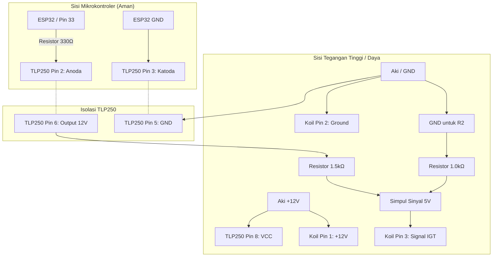

# Wiring Diagram: Tes Koil 3-Pin (Honda CRV/Stream) menggunakan TLP250

Berikut adalah panduan *wiring* untuk mengetes koil aktif 3-pin (seperti milik Honda CRV Gen 2 / Gen 3 bermesin K20/K24) menggunakan mikrokontroler ESP32 dan optocoupler **TLP250**.

> **PERINGATAN TEGANGAN (Sangat Penting):** 
> IC TLP250 membutuhkan tegangan suplai minimal **10V** untuk beroperasi. Jika disuplai 12V, keluaran sinyal (Output) dari TLP250 juga akan sebesar **12V**. 
> Sementara itu, pin *Trigger/Signal* pada koil Honda umumnya menggunakan logika **5V**. Jika Anda langsung menembak 12V dari TLP250 ke pin sinyal koil, *Igniter* di dalam koil bisa **terbakar**. 
> Solusinya: Kita wajib menggunakan penurun tegangan (*Voltage Divider* menggunakan resistor) di jalur output TLP250.

## 1. Identifikasi Pin Koil (Honda CRV / K-Series)
Secara umum, susunan pin koil 3-pin Honda jika dilihat dari depan soket (pengait di atas) adalah:
1. **+12V (IG+)**: Dihubungkan ke Positif Aki/Adaptor 12V.
2. **Ground (GND)**: Dihubungkan ke Negatif Aki/Adaptor (Massa).
3. **Signal (IGT)**: Menerima pulsa trigger 5V dari mikrokontroler/ECU.

*(Pastikan kembali dengan buku manual / multimeter, warna kabel kadang berbeda).*

## 2. Tabel Sambungan (*Wiring*)

Koneksi ini memisahkan secara total (*galvanic isolation*) antara sirkuit lemah (ESP32) dan sirkuit tegangan tinggi (Koil/Aki).

| TLP250 Pin | Nama Pin | Disambungkan Ke... | Keterangan |
| :--- | :--- | :--- | :--- |
| **Pin 1** | NC | - | *Tidak terhubung / kosong* |
| **Pin 2** | Anoda (+) | **ESP32 Pin 33** (Via Resistor 220Ω - 330Ω) | Pin Output sinyal dari ESP32 (sesuai `Pins.h`) |
| **Pin 3** | Katoda (-) | **GND ESP32** | Ground dari papan ESP32 |
| **Pin 4** | NC | - | *Tidak terhubung / kosong* |
| **Pin 5** | GND (Vee) | **Negatif Aki / Ground Koil** | Ground sisi tegangan tinggi |
| **Pin 6** | VO (Output)| **Sinyal (IGT) Koil** (Lihat Skema Resistor Bawah) | Jalur pulsa pemicu koil (Harus diturunkan ke 5V!) |
| **Pin 7** | VO | - | *Internal terhubung ke Pin 6, biarkan kosong* |
| **Pin 8** | VCC | **Positif Aki (+12V)** | Suplai tenaga untuk IC TLP250 |

## 3. Skema Penurun Tegangan (Voltage Divider)
Untuk mengubah output 12V dari TLP250 menjadi ~5V agar aman bagi koil Honda, siapkan dua buah resistor, misalnya **R1 = 1.5 kΩ** dan **R2 = 1.0 kΩ**.

Sambungkan seperti ini:
```text
TLP250 (Pin 6) -----> [ Resistor R1 (1.5k) ] -----> Titik Cabang -----> Pin Signal (IGT) Koil 3-Pin
                                                      |
                                                      |
                                            [ Resistor R2 (1.0k) ]
                                                      |
                                                      |
                                           Ground / Negatif Aki (Pin 5)
```
*Dengan rasio di atas, saat TLP250 mengeluarkan 12V, titik cabang akan berada di tegangan sekitar `1.0 / (1.5 + 1.0) * 12V = 4.8V`. Sangat aman dan cukup untuk memicu koil.*

## 4. Diagram Skematik Keseluruhan



> **Pengecekan Sebelum Dihidupkan:**
> Jangan langsung colok koil. Nyalakan alat Anda (tanpa koil), tes dengan multimeter di *Simpul Sinyal 5V* melawan Ground. Pastikan saat ESP32 memberikan pulsa, tegangan maksimal yang terbaca di multimeter tidak lebih dari 5 Volt. Setelah yakin aman, baru hubungkan ke koil.
