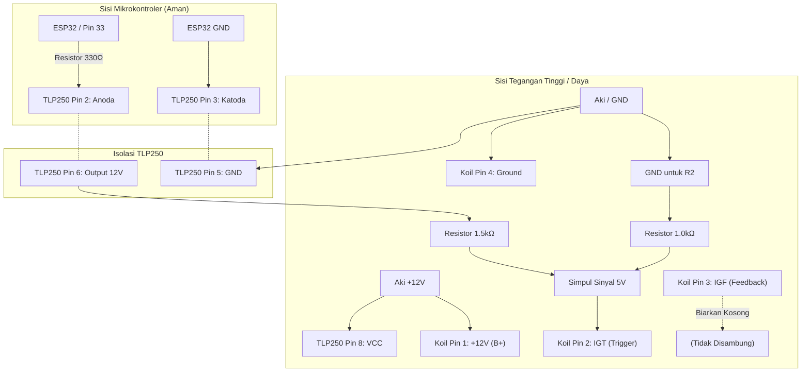

# Wiring Diagram: Tes Koil 4-Pin (Toyota Denso) menggunakan TLP250

Berikut adalah panduan *wiring* untuk mengetes koil aktif 4-pin (seperti Toyota Denso seri `90919-02266` / `90919-02244` yang umum dipakai pada RAV4, Camry, Alphard, dll) menggunakan mikrokontroler ESP32 dan optocoupler **TLP250**.

> [!WARNING]
> **PERINGATAN TEGANGAN (Sangat Penting):** 
> Sama seperti koil pintar Honda, koil Toyota Denso menggunakan logika **5V** untuk memicu percikan api. Jangan pernah menembakkan 12V murni dari output TLP250 langsung ke pin IGT koil, karena akan membakar *Igniter* internalnya. Wajib gunakan *Voltage Divider* (penurun tegangan).

## 1. Identifikasi Pin Koil (Toyota Denso 4-Pin)
Berdasarkan standar koil 4-pin Toyota tipe Denso, fungsi keempat kakinya adalah:
1. **+12V (B+)**: Arus utama positif dari aki/adaptor.
2. **IGT (Ignition Timing)**: Sinyal *trigger* 5V dari ECU (atau alat kita) untuk memerintahkan koil memercik.
3. **IGF (Ignition Feedback)**: Sinyal balik ke ECU untuk mengonfirmasi bahwa percikan berhasil terjadi (untuk deteksi *misfire*).
4. **Ground (GND)**: Negatif aki/bodi mesin.

> [!NOTE]
> **Tentang Pin IGF:** Untuk keperluan *tester* dan *simulator* sederhana ini, pin **IGF dibiarkan KOSONG / TIDAK DISAMBUNG**. Alat kita tidak memerlukan konfirmasi percikan api untuk terus berjalan.

## 2. Tabel Sambungan (*Wiring*)

| TLP250 Pin | Nama Pin | Disambungkan Ke... | Keterangan |
| :--- | :--- | :--- | :--- |
| **Pin 1** | NC | - | *Tidak terhubung / kosong* |
| **Pin 2** | Anoda (+) | **ESP32 Pin 33** (Via Resistor 220Ω - 330Ω) | Pin Output sinyal dari ESP32 (sesuai `Pins.h`) |
| **Pin 3** | Katoda (-) | **GND ESP32** | Ground dari papan ESP32 |
| **Pin 4** | NC | - | *Tidak terhubung / kosong* |
| **Pin 5** | GND (Vee) | **Negatif Aki / Ground Koil** | Ground sisi tegangan tinggi |
| **Pin 6** | VO (Output)| **Sinyal IGT Koil (Pin 2)** (Lihat Skema Penurun Tegangan) | Jalur pulsa pemicu koil (Harus diturunkan ke 5V!) |
| **Pin 7** | VO | - | *Internal terhubung ke Pin 6, biarkan kosong* |
| **Pin 8** | VCC | **Positif Aki (+12V)** | Suplai tenaga untuk IC TLP250 |

## 3. Skema Penurun Tegangan (Voltage Divider)
Gunakan rasio resistor yang sama (misal R1 = 1.5 kΩ, R2 = 1.0 kΩ) untuk menurunkan 12V output TLP250 menjadi ~4.8V (dibaca sebagai 5V oleh koil).

```text
TLP250 (Pin 6) -----> [ Resistor R1 (1.5k) ] -----> Titik Cabang -----> Pin IGT Koil (Pin 2)
                                                      |
                                                      |
                                            [ Resistor R2 (1.0k) ]
                                                      |
                                                      |
                                           Ground / Negatif Aki (Pin 5)
```

## 4. Diagram Skematik Keseluruhan (Mermaid)


